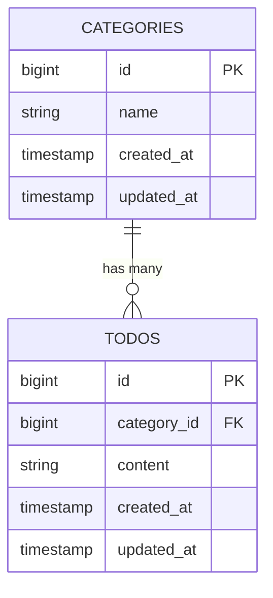

# Todo管理のアプリ

## 概要
このプロジェクトは、Laravelを使用してTodo管理のアプリを実装しています。
タスクは CRUD（Create・Read・Update・Delete）が可能で、認証は Laravel Fortify に対応しています。

## Tech Stack
| コンポーネント | バージョン |
|----------------|------------|
| PHP | 8.5.x |
| Laravel | 10.x |
| MySQL | 8.4.x |
| Docker | 最新 |

## 導入手順（GitHub から clone する場合）
1. リポジトリを clone

    ```bash
    git clone git@github.com:osakana-works/todo-app.git
    cd todo-app
    ```

2. .env を作成

    ```bash
    cp .env.example .env
    ```

3. .env の DB 設定を Sail 用に修正

    ```bash
    DB_CONNECTION=mysql
    DB_HOST=mysql
    DB_PORT=3306
    DB_DATABASE=laravel
    DB_USERNAME=sail
    DB_PASSWORD=password
    ```

4. Sail を起動

    ```bash
    ./vendor/bin/sail up -d
    ```

5. アプリキー生成

    ```bash
    ./vendor/bin/sail artisan key:generate
    ```

6. マイグレーション & 初期データ投入

    ```bash
    ./vendor/bin/sail artisan migrate --seed
    ```

7. ブラウザでアクセス


    ```bash
    http://localhost

    ```


## 環境構築
1. プロジェクト作成（Sail を使う場合）

    ```bash
    docker run --rm \
        -u "$(id -u):$(id -g)" \
        -v "$(pwd):/var/www/html" \
        -w /var/www/html \
        -e COMPOSER_CACHE_DIR=/tmp/composer_cache \
        laravelsail/php82-composer:latest \
        composer create-project laravel/laravel:^10.0 laravel-project
    ```
2. Sail インストール

    ```bash
    cd laravel-project

    docker run --rm \
        -u "$(id -u):$(id -g)" \
        -v "$(pwd):/var/www/html" \
        -w /var/www/html \
        -e COMPOSER_CACHE_DIR=/tmp/composer_cache \
        laravelsail/php82-composer:latest \
        composer require laravel/sail --dev
    ```

3. Sail セットアップ（MySQL）

    ```bash
    docker run --rm \
        -u "$(id -u):$(id -g)" \
        -v "$(pwd):/var/www/html" \
        -w /var/www/html \
        -e COMPOSER_CACHE_DIR=/tmp/composer_cache \
        laravelsail/php82-composer:latest \
        php artisan sail:install --with=mysql
    ```
4. Sail 起動

    ```bash
    ./vendor/bin/sail up -d
    ```
5. アプリキー生成

    ```bash
    sail artisan key:generate
    ```
6. マイグレーション

    ```bash
    sail artisan migrate --seed
    ``` 
7. ブラウザでアクセス
　　http://localhost


## 使用方法
1. ブラウザで以下にアクセス
http://localhost

2. ユーザー登録 or ログイン
（Fortify による認証機能）

3. Todo の作成・編集・削除が可能
-新規作成
-編集
-完了状態の更新
-削除

## 貢献方法

```bash
git checkout -b feature/機能名
git commit -m "Add: 機能名"
git push origin feature/機能名
```

## 🔗参考リンク
・Laravel 公式ドキュメント
https://laravel.com/docs

## ER図

